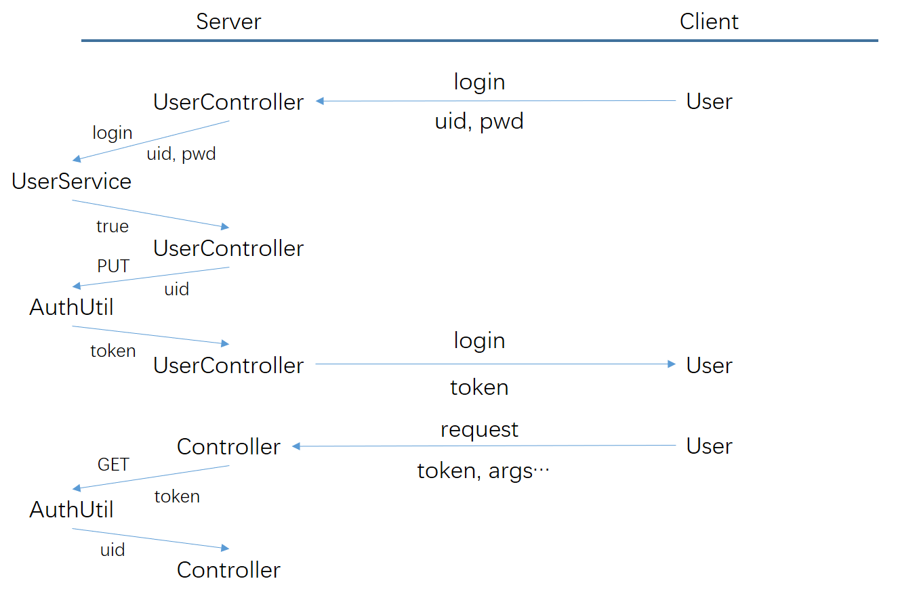

# Coupon Management Backend

A backend project providing management interfaces for coupon management and backend staff control.

## I. Usage

### 1. Authentication

This backend system authenticates staffs via `sesssion token` (abbreviated as `token` later).
A token is generated when a staff login and used to verify a request.
Please be known that not every request requires authentication and thus requires `token`

The token will be expired if no request is sent with it for a period (10 min by default).

Standard authentication procedures:

> `UserController` is implemented as `StaffController` here
> 
> `User` is implemented as `Staff` here

1. staff requests to log in server with uid and password

2. `StaffController` receives the request and validate the arguments,
then let `staffService` verify the password

3. `staffService` verifies ID and password, return `true` to `StaffController` if succeed

4. `StaffController` receives the result, notify `AuthUtil`

5. `AuthUtil` generates `token`, save `<token, uid>` to Redis Server;
return `token` to `StaffController` if succeed

6. `StaffController` returns `token` to staff who sent the request

7. For later requests, staff should send `token` to `Controller`

8. `Controller` calls `AuthUtil` to find corresponding uid with `token`

9. `Controller` finds staff with uid and justifies whether the staff has granted authority 
to invoke the request interface

### 2. Manage staffs

staffs are identified via `staffname`.
Default staff `admin` are initiated with information below.

- staffname: `admin`
- password: `admin`
- authentication level: `ADMIN`
- business: `EMPTY`

To register a staff, use [/staff/register](#staff_register) to create a staff with no authority.

To let a staff grant or lose authority or business,
use [/staff/info/request](#staff_info_request) to initiate a request.
The request should be approved by `admin` via [/staff/info/approve](#staff_info_approve).
Requests can be surfed via [/staff/info/list](#staff_info_list)

To destroy a staff, use [/staff/destroy/request](#staff_destroy_request) to initiate a request.
The request should be approved by `admin` via [/staff/destroy/approve](#staff_destroy_approve).
Requests can be surfed via [/staff/destroy/list](#staff_destroy_list)

To surf staff(s), use [/staff/search](#staff_search) to find staffs matching conditions,
or use [/staff/find](#staff_find) to find a specific staff with specified staffname.

### 3. Manage coupons

Entity `Coupon` identified by `{business, name}` is actually a context
that describes a group of coupon, does not represent individual coupon.

To post coupons, use [/coupon/post/request](#coupon_post_request) to initiate a request,
the request should be approved by staff with authentication level `SYS_ADMIN` then `ADMIN`
using [/coupon/post/approve](#coupon_post_approve).
If the coupon identifier existed, extra count of coupon(s) will be added.
Requests can be surfed via [/coupon/post/list](#coupon_post_list)

To remove coupons, use [/coupon/remove/request](#coupon_remove_request) to initiate a request,
the request should be approved by staff with authentication level `SYS_ADMIN` then `ADMIN`
using [/coupon/remove/approve](coupon_remove_approve).
If requested count is `0`(default), all coupon(s) will be removed and cleared.
Requests can be surfed via [/coupon/remove/list](#coupon_remove_list)

## II Database Tables

### 1. coupon.staff

- **PK** `String name` username, limit 32 characters
- `String pwd` password, limit 32 characters
- `Short auth` authentication level
- `String business` business, limit 32 characters

### 2. coupon.coupon

- **PK** `String business` business, limit 32 characters
- **PK** `String name` coupon name, limit 32 characters
- `Short type` coupon type
- `BigDecimal value` coupon value
- `BigDecimal limit` limit value to use coupon
- `Integer remain` remain count of coupon
- `Integer total` total count of coupon
- `Date start` date when coupon take effect
- `Date end` date when coupon expire

## III Interfaces

### 1. Staff Controller

#### (1) /staff/login 

Log in backend server.

Type: `HTTP GET`

Require authentication level: `ANY`

Arguments:

- `String name` username, limit 32 characters
- `String pwd` password, limit 32 characters

Returns:

`String token` return generated token that identifies this session and staff authority, used for later requests.

---

#### (2) /staff/register 

Register an account with no authority.

Type: `HTTP POST`

Require authentication level: `ANY`

Arguments:

- `String name` username, limit 32 characters
- `String pwd` password, limit 32 characters

Returns:

`Boolean result` true if success

Example:

> Input: `http://SERVER/staff/register?name=admin&pwd=admin`
> 
> Return: `true`

---

#### (3) /staff/destroy/request 

Initiate a request to destroy an account.

Type: `HTTP POST`

Require authentication level: `staff` (if authentication level lower than `sys_admin`,
you can only request to destroy account of current session)

Arguments:

- `String token` token of current session, used for authentication
- `String name` username of account to be destroyed

Returns:

`Boolean result` true if request initiated

Example:

> Input: `http://SERVER/staff/destroy/request?token=TEST&name=admin`
> 
> return: `true`

---

#### (4) /staff/destroy/approve 

Approve a request to destroy an account.

Type: `HTTP DELETE`

Require authentication level: `admin`

Arguments:

- `String token` token of current session, used for authentication
- `String id` id of the request

Returns:

`Boolean result` true if request approved

> Input: `http://SERVER/staff/destroy/approve?token=TEST&id=TEST`
>
> return: `true`

---

#### (5) /staff/destroy/list 

Get a list of requests to destroy an account, return 10 requests each time.

Type: `HTTP GET`

Require authentication level: `admin`

Arguments:

- `String token` token of current session, used for authentication
- `String target` username of target account, support string-contain, default: `""`
- `String initiator` username of initiator account, support string-contain, default: `""`
- `Integer page` page switch, default: `0`

Returns:

`List<StaffRequest> result` a list of staff requests

Example:

> Input: `http://SERVER/staff/destroy/list?token=TEST&target=%25&initiator=%25&page=0`
> 
> Return: `[{"category":1,"target":{"username":"admin","pwd":null,"business":null,"auth":null},"initiator":"admin","approve":0},
> {"category":1,,"target":{"username":"sys_admin","pwd":null,"business":null,"auth":null},"initiator":"admin","approve":0}]`

---

#### (6) /staff/pwd 

Change password of account of current session.

Type: `HTTP PUT`

Require authentication level: `staff`

Arguments:

- `String token` token of current session, used for authentication
- `String oldPwd` old password
- `String newPwd` new password

Returns:

`Boolean result` true if success

Example:

> Input: `http://SERVER/staff/pwd?token=TEST&oldPwd=pwd&newPwd=new_pwd`
> 
> Return: `true`

---

#### (7) /staff/info/request 

Initiate a request to change info (authentication level or business) of a staff.

Type: `HTTP POST`

Require authentication level: `ANY`

Arguments:

- `String token` token of current session, used for authentication
- `Short auth` authentication level, default: -1 (not to set)
- `String business` business, default: "" (not to set)

Returns:

`Boolean result` true if request initiated

Example:

> Input: `http://SERVER/staff/info/request?token=TEST&auth=2&business=GAMING`
> 
> Return: `true`

---

#### (8) /staff/info/approve 

Approve a request to change info (authentication level or business) of a staff. 

Type: `HTTP PUT`

Require authentication level: `admin`

Arguments:

- `String token` token of current session, used for authentication
- `String id` id of the request

Returns:

`Boolean result` true if request approved

> Input: `http://SERVER/staff/info/approve?token=TEST&id=TEST`
>
> return: `true`

---

#### (9) /staff/info/list 

Get a list of requests to change info (authentication level or business) of an account, return 10 requests each time.

Type: `HTTP GET`

Require authentication level: `admin`

Arguments:

- `String token` token of current session, used for authentication
- `String target` username of target account, string-contain, default: `""`
- `String initiator` username of initiator account, string-contain, default: `""`
- `Integer page` page switch, default: `0`

Returns:

`List<StaffRequest> result` a list of staff requests

Example:

> Input: `http://SERVER/staff/info/list?token=TEST&target=%25&initiator=%25&page=0`
>
> Return: `[{"category":2,"target":{"username":"admin","pwd":null,"business":"GAMING","auth":1},"initiator":"admin","approve":0},
> {"category":2,,"target":{"username":"sys_admin","pwd":null,"business":"SELL","auth":2},"initiator":"admin","approve":0}]`

---

#### (10) /staff/find 

Find a staff with specified username

Type: `HTTP GET`

Arguments:

- `String name` username

Returns:

`Staff result` found staff, return empty if not found

Example:

> Input: `http://SERVER/staff/find?name=admin`
> 
> Return: `{"username":"admin","pwd":null,"business":"EMPTY","auth":4}`

---

#### (11) /staff/search 

Search staffs matching specified conditions

Type: `HTTP GET`

Arguments:

- `String name` username, support SQL string-like, default: `%`
- `String business` business, support SQL string-like, default: `%`
- `Integer page` page switch, default: 0

Returns:

`List<Staff> staffs` a list of staffs matching specified conditions

Example:

> Input: `http://SERVER/staff/search?name=%25&business=%25&page=0`
> 
> Return: `[{"username":"admin","pwd":null,"business":"EMPTY","auth":4},
> {"username":"sys_admin","pwd":null,"business":"EMPTY","auth":3}]`

---

### 2. Coupon Controller

#### (1) /coupon/post/request 

Initiate a request to post coupon(s)

Type: `HTTP POST`

Require authentication level: `ANY`

Arguments:

- `String token` token of current session, used for authentication
- `String business` coupon business
- `String name` coupon name
- `Integer count` coupon count
- `Integer value` coupon value
- `Integer limit_value` coupon limit
- `Date start` when the coupon take effect
- `Date end` when the coupon expire

Returns:

`Boolean result` true if request initiated

Example:

> Input: `http://SERVER/coupon/post/request?token=TEST&business=GAMING&name=40OFF&count=10&value=0.6&limit=0&start=2023-11-1&end-2023-11-11`
>
> Return: `true`

---

#### (2) /coupon/post/approve 

Approve a request to post coupon(s)

Type: `HTTP PUT`

Require authentication level: `sys_admin`

Arguments:

- `String token` token of current session, used for authentication
- `String id` id of the request

Returns:

`Boolean result` true if request approved

> Input: `http://SERVER/coupon/post/approve?token=TEST&id=TEST`
>
> return: `true`

---

#### (3) /coupon/post/list 

Get a list of requests to post coupon(s), return 10 requests each time.

Type: `HTTP GET`

Require authentication level: `bus_admin`

Arguments:

- `String token` token of current session, used for authentication
- `String business` username of target account, support string-contain, default: `""`
- `String name` username of target account, support string-contain, default: `""`
- `String initiator` username of initiator account, support string-contain, default: `""`
- `Integer page` page switch, default: `0`

Returns:

`List<CouponRequest> result` a list of coupon requests

Example:

> Input: `http://SERVER/coupon/post/list?token=TEST&business=GAMING&name=%25&initiator=%25&page=0`
>
> Return: `[{"category":1,"coupon":{"business":"GAMING","name":"40OFF","value":0.6,"limitValue":0,"remain":6,"total":10,"start":2023-11-1,"end":2023-11-11},"initiator":"bus_admin","approve":0},
> {"category":1,"coupon":{"business":"GAMING","name":"40CUT","value":40,"limitValue":200,"remain":2,"total":5,"start":2023-11-1,"end":2023-11-11},"initiator":"bus_admin","approve":0}]`

---

#### (4) /coupon/remove/request 

Initiate a request to remove coupon(s)

Type: `HTTP POST`

Require authentication level: `ANY`

Arguments:

- `String token` token of current session, used for authentication
- `String business` coupon business
- `String name` coupon name
- `Integer count` coupon count, default: 0 (all coupons and clear)

Returns:

`Boolean result` true if request initiated

Example:

> Input: `http://SERVER/coupon/remove/request?token=TEST&business=GAMING&name=40OFF&count=10`
>
> Return: `true`

---

#### (5) /coupon/remove/approve 

Approve a request to remove coupon(s)

Type: `HTTP PUT`

Require authentication level: `sys_admin`

Arguments:

- `String token` token of current session, used for authentication
- `String id` id of the request

Returns:

`Boolean result` true if request approved

> Input: `http://SERVER/coupon/remove/approve?token=TEST&id=TEST`
>
> return: `true`

---

#### (6) /coupon/remove/list 

Get a list of requests to post coupon(s), return 10 requests each time.

Type: `HTTP GET`

Require authentication level: `bus_admin`

Arguments:

- `String token` token of current session, used for authentication
- `String business` username of target account, support string-contain, default: `""`
- `String name` username of target account, support string-contain, default: `""`
- `String initiator` username of initiator account, support string-contain, default: `""`
- `Integer page` page switch, default: `0`

Returns:

`List<CouponRequest> result` a list of coupon requests

Example:

> Input: `http://SERVER/coupon/post/list?token=TEST&business=GAMING&name=%25&initiator=%25&page=0`
>
> Return: `[{"category":2,"coupon":{"business":"GAMING","name":"40OFF","value":null,"limitValue":0,"remain":null,"total":0,"start":null,"end":null},"initiator":"bus_admin","approve":0},
> {"category":2,"coupon":{"business":"GAMING","name":"40CUT","value":null,"limitValue":null,"remain":null,"total":5,"start":null,"end":null},"initiator":"bus_admin","approve":0}]`

---

#### (7) /coupon/search 

Search coupon with restrictions, return 10 objects each time

Type: `HTTP GET`

Require authentication level: `bus_admin`

Arguments:

- `String token` token of current session, used for authentication
- `String business` username of target account, support SQL string-like, default: `%`
- `String name` username of target account, support SQL string-like, default: `%`
- `BigDecimal minValue` minimum value of coupon(s), support SQL string-like, default: `0`
- `BigDecimal maxValue` maximum value of coupon(s), support SQL string-like, default: `1000000`
- `BigDecimal minLimit` minimum limit of coupon(s), support SQL string-like, default: `0`
- `BigDecimal maxLimit` maximum limit of coupon(s), support SQL string-like, default: `1000000`
- `Date start` after when the coupon expire, default: 1970-1-1
- `Date end` before when the coupon take effect, default: 2100-1-1
- `Integer page` page switch, default: `0`

Returns:

`List<CouponRequest> result` a list of coupon requests

Example:

> Input: `http://SERVER/coupon/post/list?token=TEST&business=GAMING&name=%25&page=0`
>
> Return: `[{"business":"GAMING","name":"40OFF","value":null,"limitValue":0,"remain":null,"total":0,"start":null,"end":null},
> {"business":"GAMING","name":"40CUT","value":null,"limitValue":null,"remain":null,"total":5,"start":null,"end":null}]`

---

#### (8) /coupon/distribute 

Distribute specified amount of coupon(s).

Type: `HTTP PUT`

Require authentication level: `bus_admin`

Arguments:

- `String token` token of current session, used for authentication
- `String business` coupon business
- `String name` coupon name
- `Integer count` count

Returns:

`Boolean result` true if success

Example:

> Input: `http://SERVER/coupon/distribute?token=TEST&business=GAMING&name=40OFF&count=1`
> 
> Return: `true`

---